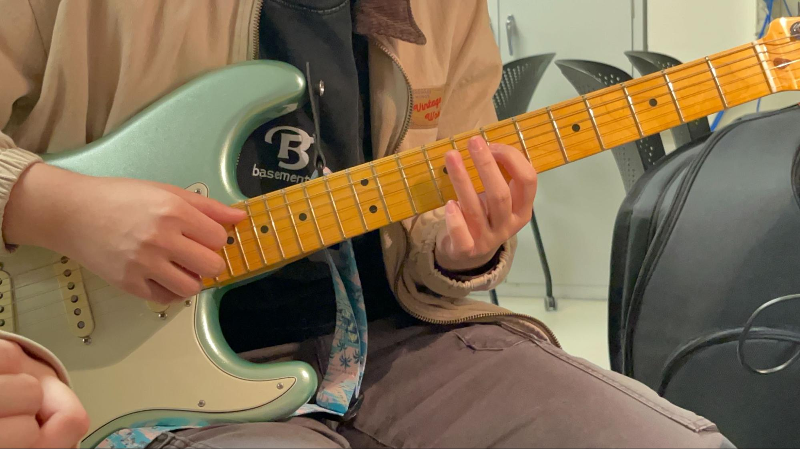
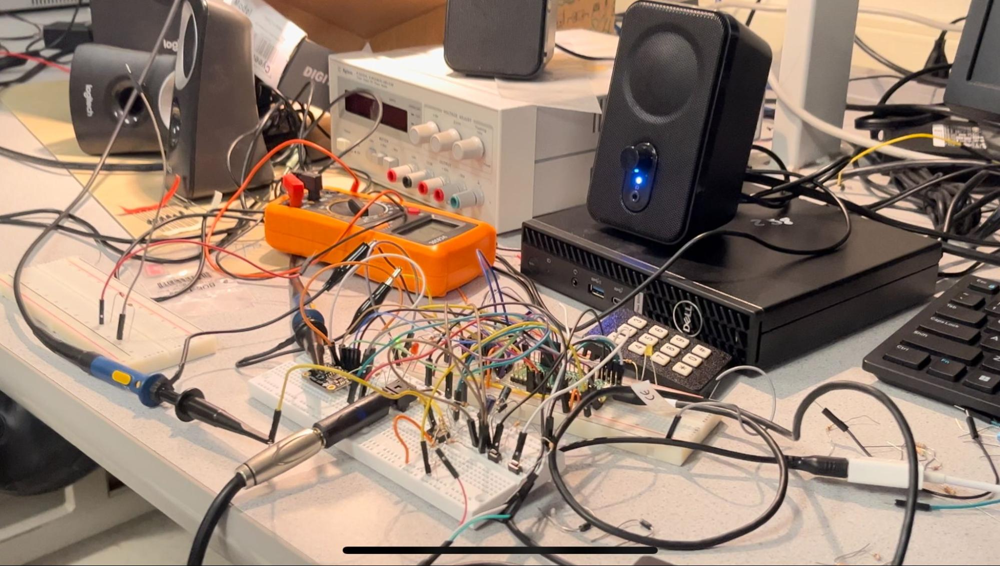
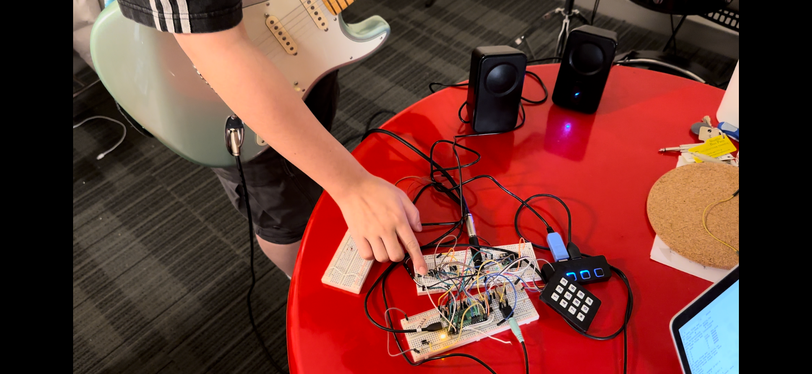
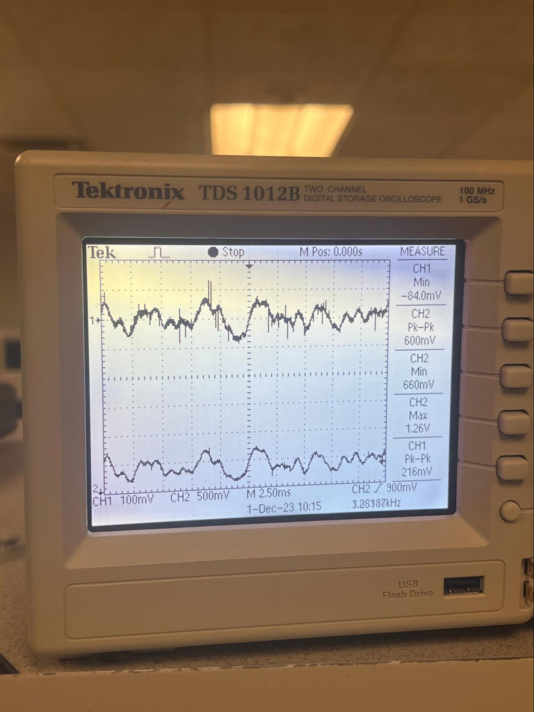

## Results of the design

### Any and all test data, scope traces, waveforms, etc

* Signal pre and post op-amp
* Signal post op-amp and from DAC

We scoped signal from the guitar (ch2) and fram dac (ch1). The guitar signal has a peak to peak range around 200 mV, whereas the signal from dac is amplified to a peak to peak of 600mV. The guitar signal is amplified successfully within the voltage range 0 - 3.3V. The DAC output seems to exhibit mor noise, which could be due to the digital sampling and processing or noise introduced by DAC. The waveform shapes suggest that the fundamental frequencies are being preserved. 

### speed of execution (hesitation, flicker, interactiveness, concurrency)

* **Hesitation & Flicker**: our looper is able to achieve no delay when looping tracks. Multiple tracks are ableto be aligned correctly with no perceptible time discrepancies. This allows musician to maintain musical integrity and synchronicity of the composition. 
* **Concurrency**: our circuit design allows concurrent connection of the amplified guitar signal output and DAC output to the left and right stereo channels separately. This enables the simultaneous output of current guitar sound and looper playback sound. Musicians are able to receive immediate feedback as they record, allowing them to access how the new layer integrates with existing loops. This concurrency feature is crucial for making real-time adjustments to achieve the desired music composition.
* **Interactiveness**: the design choice of three buttons - record, play, and clean - provides straightforward and essential control for the loop station, making sure its easy to use and minimizing confusion. Traditional loop stations usually have a two-button design that integrates clean and record functions using time delay (short press for record and long press for clean). Compared to two-button design, three distinct buttons provide clear and intuitive controls for different functions. It’s easier to interact with since musicians can easily identify and understand the purpose of each button without ambiguity. However, one future improvement of our system is using footswitches or foot pedals rather than regular push buttons. Footswitches allow musicians to operate the loop station hands-free and provide greater freedom for playing instruments or manipulating other controls. It also allows musicians to trigger functions without any delay. 

### accuracy (numeric, music frequencies, video signal timing, etc)
* Numeric: To ensure not too much noise are included in our computation, we right shift ADC and DAC to eliminate the ineffective lower bits. We also try to preserve all the large numbers without overflowing and only scale down them if necessary (when it has reached the hardware’s limitation).
* Music Frequencies: For music frequency, we sampled at 8k Hz which is slightly lower than what we should sampled at according to Nyquist–Shannon sampling theorem. Nyquist–Shannon theorem determined the sampling frequency by multiplying the max frequency we want to sample by 2 to ensure the sounds are consistent and clear. We didn’t do so because Bruce suggested that we go with 8k Hz because we are working on a breadboard and can have pin capacitance.
* 
### how you enforced safety in the design.
* Make sure not to feed voltage >3.3V into GPIO
To enforce this, we always scope anything going into the GPIOs, and also we protect them with current limiting resistors. For potential reversed voltage, we also used diode to cap it at 0V.
 
### Usability by you and other people
* From functionality point of view, Pi-Looper definitely performs its intended tasks effectively. However, there’re still some aspects of systems need to be improve for a better usability. We build all our circuit on the breadboard, but to have a more compact design, our circuit could be improved by using PCB. A PCB reduces the chance of loose connections and wiring errors that can occur with hand wired circuit. Additionally, it would be better if we have a custom 3D-printed case to protect circuit components from physical or environmental damage. As for the serial communication we used to save and retrive tracks in FRAM, a graphic user interface is necessary for people who are not familiar with terminal commands. 

## Conclusions

### Analyse your design in terms of how the results met your expectations. What might you do differently next time?
Our design in general met our expectations. The loop station we designed allows musicians to record, paly, layer, and save instrumental tracks. It supports a wide range of instruments such as guitar, bass, or electric drums. It can also layer multiple tracks, and there is no specific limit on the number of tracks that can be layered. Musicians can play back the recorded tracks in real-time and even when the system is rebooted after powering off. However, an issue with level of noise in the recordings still exist. We tried a couple of methods that indeed improved the noise problem but we didn’t have enough time to address this issue comprehensively. There are some considerations and adjustments we might do differently next time: 1. Conduct thorough analysis to identify specific sources and frequencies of noises. 2. Explore advanced amplifier circuit designs or filtering techniques. 3. Carefully select and test each circuit component befor we put everything together. 4. Document each modification made and the reason behind to address certain issues as well as its impact. 

### How did your design conform to the applicable standards?

#### Intellectual property considerations.
1. Did you reuse code or someone else's design? Did you use any of Altera's IP? Used Bruce’s code on FRAM and reused some of 4760’s lab code. 
2. Did you use code in the public domain? If 4760 counts, then yes
3. Are you reverse-engineering a design? How did you deal with patent/trademark issues? 
4. We were inspired by the commercial looper station’s functionality and we built it step by step without referencing their design which isn’t published as well. 
5. Did you have to sign non-disclosure to get a sample part? No
6. Are there patent opportunites for your project? No, we used widely used concepts and designs

## Appendix A: permissions
The group approves this report for inclusion on the course website.
The group approves the video for inclusion on the course YouTube channel.

## Additional appendices
References we used:
https://spiceman.net/non-inverting-amplifier-circuit/ 
https://en.wikipedia.org/wiki/Low-pass_filter 
https://people.ece.cornell.edu/land/courses/ece4760/RP2040/C_SDK_memory/index_memory.html 
