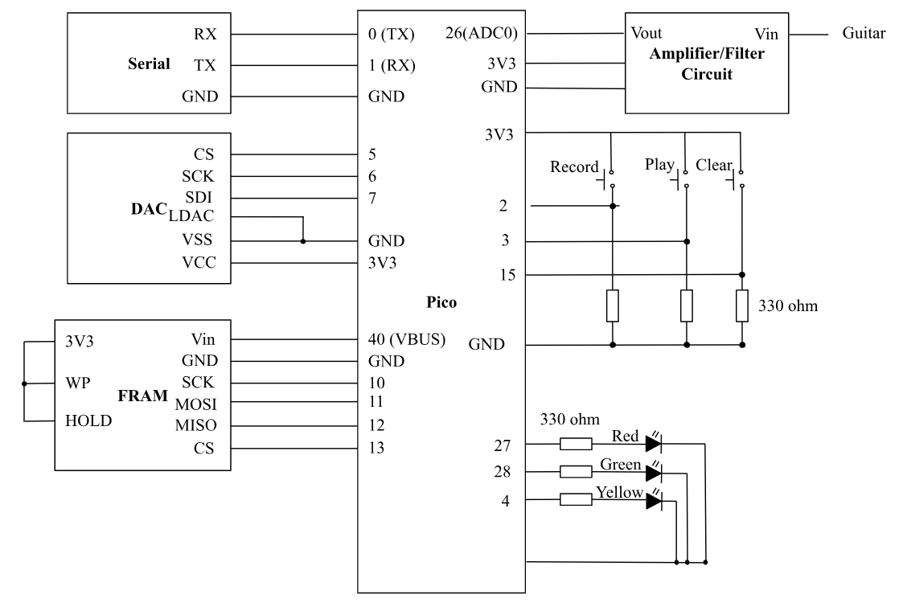
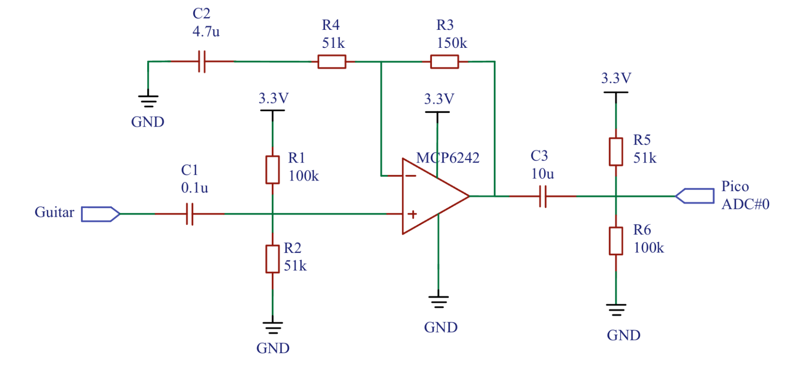
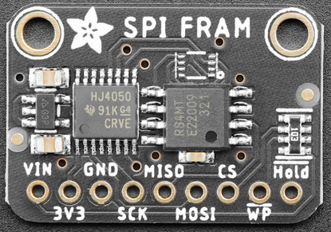

## **Program/hardware design**
### hardware 
#### Schematics and wiring

#### Amplifier circuit

This circuit takes in the guitar input and passes it through a 0.1u decoupling capacitor. This capacitor will block any DC component of the signal and only allow AC signal to pass through, helping us to eliminate DC noise. Then R1 and R2 form a voltage divider to bias the op-amp and increase the signal’s value. These three components also form a high pass filter which has the following cut-off frequency:
fcutoff=12RC=12**33.33k*0.1u=47.772Hz
We know that common guitars usually produce effective sounds frequency from 75 to 5k Hz, so this cutoff frequency helps as eliminate low frequencies noise. 
The op-amp circuit has a gain of 1+R3R4=4 and amplifies the guitar input to have a greater pk-to-pk. The non-inverting input at pin 3 receives the guitar signal, while the inverting input at pin 2 is connected to the output at pin 1 through a feedback loop, which sets the gain of the amplifier. The feedback capacitor C2 helps roll off high-frequencies. The op-amp output is connected to another decoupling capacitor C1 to help us further ensure there’s no DC noise. Then passed through a set of R5 and R6 which is to bias the output to be a little smaller since we don’t want to break the GPIO.
To safely protect our GPIO from overvoltage, we added a Schottky diode in parallel with our Pico ADC. The diode will be turned on when the voltage is over 3.3V or lower than 0V, passing the overvoltage or reversed-voltage current directly to GND. When the voltage is smaller than 3.3 V but greater than 0, the diode is opened, so all the current can reach ADC.

#### Pico ADC
We used the on-board ADC at GPIO 26 which receives the output of the amplifier and it’s a 12-bit ADC with lower section 3 bits being noise so we right-shift 3 to eliminate those and left-shift before passing it to DAC.

#### External DAC (SPI)
We used the MCP4822 DAC with two independent DACs, each with a 12-bit resolution. The 12-bit input values for the DACs are written to the Pico via SPI interface (SDI, SCK, /CS) and clocked into the input register. Its output amplifier circuitry allows voltages down to 0V to operate with low output impedance for driving external loads. Output is then connected to the audio jack and connected to the speaker set. 

#### FRAM (SPI)
We learned abut FRAM and our memory restriction from Bruce. Pico’s RAM is around 260 KB with a 2MB flash program memory. This is enough for digital synthesized sounds, but not for audio recordings’ saving and replaying. Therefore, we look into using the nonvolatile FRAM that’s byte-addressable. Though it’s smaller than SD card, it’s enough for us to store small audio samples, enabling fast read/write of data. According to Bruce, we used MB85RS4MT which is a “half-megabyte memory which can read/write at 5 MB/sec over SPI using a 40 MHz SPI clock.” 
For writing and reading out of FRAM, we used fOpen(char* fileName) to create a file in FRAM, then fWrite(open_block_index, input_pointer, num_bytes) to write the data in the buffer to the file, and fClose(open_block_index) to close the file. For reading the file out of FRAM when the user want to play the saved audio, fRead(open_block_index, output_pointer, num_bytes) is used.

