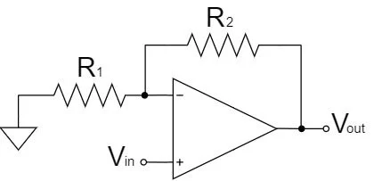
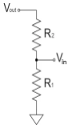
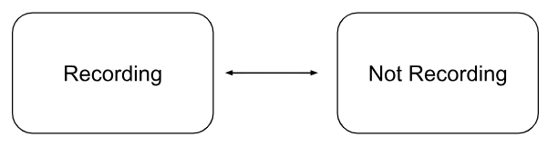
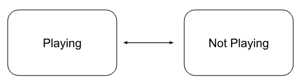
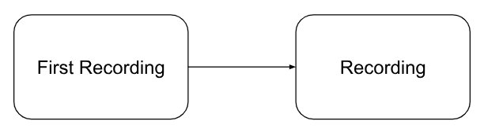

### Rationale and sources of our project idea
* The inspiration of “Pi-Looper” emerged from a shared passion of music of all three members. We noticed that sometimes it’s very difficult for solo performers to create a full and dynamic sound without additional band members. With our experience in Lab1, where we synthesized bird songs using a DAC, we saw the potential to record, process, and playback audio using Raspberry Pi Pico. Therefore, we decided to build a loop station that allows solo performers to build up layers during a live performance and create intricate arrangements that appear as multiple musicians are playing simultaneously.

### Background math
#### Non-inverting Amplifier Circuit
A non-inverting amplifier circuit is an operational amplifier (op-amp) configuration where the input signal is connected to the non-inverting terminal (+) and the feedback is applied to the inverting terminal (-). The output is taken from the opamp’s output terminal. The key characteristic of a non-inverting amplifier is that it provides a voltage gain, which means the output voltage is amplified in relation to the input voltage. 

<figure style="width: 300px" class="align-center">
  
  <figcaption>Fig.1. My hair before learning ECE.</figcaption>
</figure> 
In an ideal op amp, we assume Vp = Vn and Ip=In =0 in a linear region. Since Vn=Vin, we can get  Vp=Vn=Vin. This simplifies the amplifier circuit to a voltage divider circuit:

Thus,  Vout=R1+R2R1*Vin=(1+R2R1)Vin. This equation can be rearranged to obtain the gain (A) of the circuit: A(1+R2R1). This background is essential for us to incorporate amplifier circuits for instrumental signal in our loop station design.

#### Low pass filter
Low pass filter is a circuit that allows low-frequency signals to pass through while blocking higher frequency signals. Instrumental signals, especially from a guitar or other electronic instruments, may contain high-frequency noises. A low pass filter helps to eliminate higher frequencies to form a cleaner audio signal. It can also prevent aliasing in digital processing. Aliasing happens when high-frequency components in the input signal exceed half of the digital samplin rate, in our case 8kHz, which could lead to distortion or unwanted sound effects. The diagram below shows a capacitive low-pass filter. The cutoff frequency of the circuit is calculated by f=1/(2πRC). 

#### High pass filter
A high-pass filter is a circuit that passes signals with high frequencies while attenuating lower-frequency signals. A high-pass filter is very efficient in filtering out low-frequency noises such as electrical hum, interference, or background rumble. The cutoff frequency of the high-pass filter in the diagram below can be calculated as: f=1/(2πRC). 

#### Nyquist–Shannon sampling theorem
The theorem suggests that a continuous signal can be completely represented in its samples and fully reconstructed from those samples if the sampling frequency is greater than twice the highest frequency of the signal. The recording aspect of the loop station is a sampling process of converting continuous-time signal into discrete-time signal by taking measurements of the signal at fixed time intervals. 
The ** Nyquist rate ** is defined as twice the maximum frequency present in the signal. For example, the highest effective frequency of a electrical guitar signal is 5 kHz, the Nyquist rate should by 10 kHz to ensure that the original signal can be accurately represented by its samples.
** Aliasing ** happens if a signal is sampled below its Nyquist rate. It is the phenomenon when different signals become indistinguishable during sampling processes. High frequency components of the signal can be reflected into lower frequency range, causing distortion of the sample.

#### Superposition of waves
In order to implement looper's basic function of adding different tracks of music together, we utilized principle of superposition by summing up the individual track value. To prevent from value overflow, we first attenuated the amplitude of each track by 50% and then summed them up. 

### logical structure
We don’t have specific FSM when we implement, instead, we used state variables to switch between different stages: first time recording, recording, playing, pause, clear.

#### Recording

For the state change between Recording and Not Recording, there are three methods:
1. Pressing the recording button when the recording is on, doesn’t care about if playing or not.
2. In recording mode, the recording time limit is up (10 seconds), it will automatically go to not recording and turn on playing. 
3. Press the playing button when in recording mode, when play is also on, will stop the playing and recording

#### Playing

For the state change between Recording and Not Recording, there are two methods:
Pressing the playing button when it’s not first time recording and not already playing will be able to play back the previous recordings. 
If pressing it when already playing, then it will pause.

#### First Recording 

For the state change between First Recording and Not Recording, there is one method: 
Pressing the recording button when it’s at first recording will change it to recording

### hardware/software trade-offs
Trade-off in our design includes 
* ADC noise
* High-frequency noise because we didn’t have low pass filter because we didn’t suspect that high-frequency noise is predominant when sampling.
* Memory restricting the length of each track
* Noise due to low sampling rate of 8k when guitar can produce 5k (Nyquist-Shar)
Discuss existing patents, copyrights, and trademarks which are relevant to your project.
