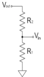
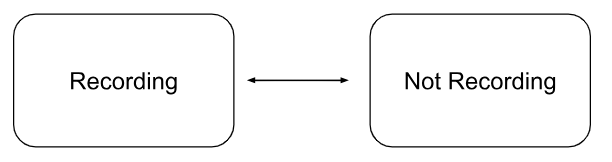
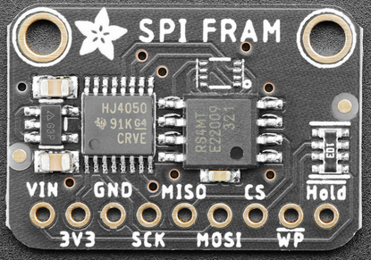
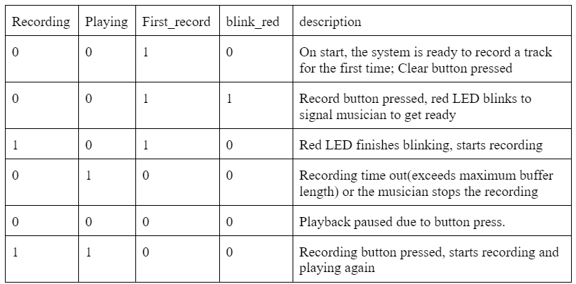
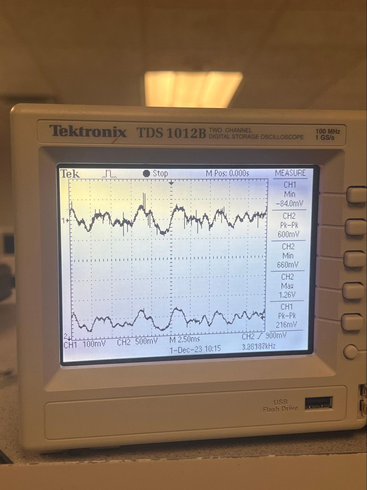

## **Project Introduction**

### One sentence "sound bite" that describes your project.
“Pi-Looper”, an innovative and affordable loop station empowers musicians to record and create their musical journey. 
### A summary of what you did and why.
* A loop station is a music device used by musicians for recording, looping, and playing back audio snippets in real-time during performance. It allows musicians to capture and reproduce short musical segments, often played on instruments or vocals, and then layer these recordings on top of each other to build complex arrangements. 
* We developed a loop station called “Pi-Looper” using Raspberry Pi Pico that empowers musicians to effortlessly layer, record, and save instrument tracks. Unlike traditional loop stations, “Pi-Looper” incorporates FRAM to enable users to save and retrieve tracks through serial communication, providing a new level of flexibility and persistence in music creations. We designed and tested an amplifier circuit to amplify instrument signal, in our case a guitar signal, to an optimal input range for the pico’s ADC. We then implemented loop station logic by designing a finite state machine (FSM) based on button inputs for record, playback, stop, and clear functionalities.

## **High level design**
### Rationale and sources of our project idea
* The inspiration of “Pi-Looper” emerged from a shared passion of music of all three members. We noticed that sometimes it’s very difficult for solo performers to create a full and dynamic sound without additional band members. With our experience in Lab1, where we synthesized bird songs using a DAC, we saw the potential to record, process, and playback audio using Raspberry Pi Pico. Therefore, we decided to build a loop station that allows solo performers to build up layers during a live performance and create intricate arrangements that appear as multiple musicians are playing simultaneously.

### Background math
#### Non-inverting Amplifier Circuit
A non-inverting amplifier circuit is an operational amplifier (op-amp) configuration where the input signal is connected to the non-inverting terminal (+) and the feedback is applied to the inverting terminal (-). The output is taken from the opamp’s output terminal. The key characteristic of a non-inverting amplifier is that it provides a voltage gain, which means the output voltage is amplified in relation to the input voltage. 

In an ideal op amp, we assume Vp = Vn and Ip=In =0 in a linear region. Since Vn=Vin, we can get  Vp=Vn=Vin. This simplifies the amplifier circuit to a voltage divider circuit:

Thus,  Vout=R1+R2R1*Vin=(1+R2R1)Vin. This equation can be rearranged to obtain the gain (A) of the circuit: A(1+R2R1). This background is essential for us to incorporate amplifier circuits for instrumental signal in our loop station design.

#### Low pass filter
Low pass filter is a circuit that allows low-frequency signals to pass through while blocking higher frequency signals. Instrumental signals, especially from a guitar or other electronic instruments, may contain high-frequency noises. A low pass filter helps to eliminate higher frequencies to form a cleaner audio signal. It can also prevent aliasing in digital processing. Aliasing happens when high-frequency components in the input signal exceed half of the digital samplin rate, in our case 8kHz, which could lead to distortion or unwanted sound effects. The diagram below shows a capacitive low-pass filter. The cutoff frequency of the circuit is calculated by f=1/(2πRC). 

#### High pass filter
A high-pass filter is a circuit that passes signals with high frequencies while attenuating lower-frequency signals. A high-pass filter is very efficient in filtering out low-frequency noises such as electrical hum, interference, or background rumble. The cutoff frequency of the high-pass filter in the diagram below can be calculated as: f=1/(2πRC). 

#### Nyquist–Shannon sampling theorem
The theorem suggests that a continuous signal can be completely represented in its samples and fully reconstructed from those samples if the sampling frequency is greater than twice the highest frequency of the signal. The recording aspect of the loop station is a sampling process of converting continuous-time signal into discrete-time signal by taking measurements of the signal at fixed time intervals. 
The ** Nyquist rate ** is defined as twice the maximum frequency present in the signal. For example, the highest effective frequency of a electrical guitar signal is 5 kHz, the Nyquist rate should by 10 kHz to ensure that the original signal can be accurately represented by its samples.
** Aliasing ** happens if a signal is sampled below its Nyquist rate. It is the phenomenon when different signals become indistinguishable during sampling processes. High frequency components of the signal can be reflected into lower frequency range, causing distortion of the sample.

#### Superposition of waves
In order to implement looper's basic function of adding different tracks of music together, we utilized principle of superposition by summing up the individual track value. To prevent from value overflow, we first attenuated the amplitude of each track by 50% and then summed them up. 

### logical structure
We don’t have specific FSM when we implement, instead, we used state variables to switch between different stages: first time recording, recording, playing, pause, clear.
#### Recording

For the state change between Recording and Not Recording, there are three methods:
1. Pressing the recording button when the recording is on, doesn’t care about if playing or not.
2. In recording mode, the recording time limit is up (10 seconds), it will automatically go to not recording and turn on playing. 
3. Press the playing button when in recording mode, when play is also on, will stop the playing and recording

#### Playing

For the state change between Recording and Not Recording, there are two methods:
Pressing the playing button when it’s not first time recording and not already playing will be able to play back the previous recordings. 
If pressing it when already playing, then it will pause.

#### First Recording 

For the state change between First Recording and Not Recording, there is one method: 
Pressing the recording button when it’s at first recording will change it to recording

### hardware/software trade-offs
Trade-off in our design includes 
* ADC noise
* High-frequency noise because we didn’t have low pass filter because we didn’t suspect that high-frequency noise is predominant when sampling.
* Memory restricting the length of each track
* Noise due to low sampling rate of 8k when guitar can produce 5k (Nyquist-Shar)
Discuss existing patents, copyrights, and trademarks which are relevant to your project.

## **Program/hardware design**
### hardware 
#### Schematics and wiring

#### Amplifier circuit

This circuit takes in the guitar input and passes it through a 0.1u decoupling capacitor. This capacitor will block any DC component of the signal and only allow AC signal to pass through, helping us to eliminate DC noise. Then R1 and R2 form a voltage divider to bias the op-amp and increase the signal’s value. These three components also form a high pass filter which has the following cut-off frequency:
fcutoff=12RC=12**33.33k*0.1u=47.772Hz
We know that common guitars usually produce effective sounds frequency from 75 to 5k Hz, so this cutoff frequency helps as eliminate low frequencies noise. 
The op-amp circuit has a gain of 1+R3R4=4 and amplifies the guitar input to have a greater pk-to-pk. The non-inverting input at pin 3 receives the guitar signal, while the inverting input at pin 2 is connected to the output at pin 1 through a feedback loop, which sets the gain of the amplifier. The feedback capacitor C2 helps roll off high-frequencies. The op-amp output is connected to another decoupling capacitor C1 to help us further ensure there’s no DC noise. Then passed through a set of R5 and R6 which is to bias the output to be a little smaller since we don’t want to break the GPIO.
To safely protect our GPIO from overvoltage, we added a Schottky diode in parallel with our Pico ADC. The diode will be turned on when the voltage is over 3.3V or lower than 0V, passing the overvoltage or reversed-voltage current directly to GND. When the voltage is smaller than 3.3 V but greater than 0, the diode is opened, so all the current can reach ADC.

#### Pico ADC
We used the on-board ADC at GPIO 26 which receives the output of the amplifier and it’s a 12-bit ADC with lower section 3 bits being noise so we right-shift 3 to eliminate those and left-shift before passing it to DAC.

#### External DAC (SPI)
We used the MCP4822 DAC with two independent DACs, each with a 12-bit resolution. The 12-bit input values for the DACs are written to the Pico via SPI interface (SDI, SCK, /CS) and clocked into the input register. Its output amplifier circuitry allows voltages down to 0V to operate with low output impedance for driving external loads. Output is then connected to the audio jack and connected to the speaker set. 

#### FRAM (SPI)
We learned abut FRAM and our memory restriction from Bruce. Pico’s RAM is around 260 KB with a 2MB flash program memory. This is enough for digital synthesized sounds, but not for audio recordings’ saving and replaying. Therefore, we look into using the nonvolatile FRAM that’s byte-addressable. Though it’s smaller than SD card, it’s enough for us to store small audio samples, enabling fast read/write of data. According to Bruce, we used MB85RS4MT which is a “half-megabyte memory which can read/write at 5 MB/sec over SPI using a 40 MHz SPI clock.” 
For writing and reading out of FRAM, we used fOpen(char* fileName) to create a file in FRAM, then fWrite(open_block_index, input_pointer, num_bytes) to write the data in the buffer to the file, and fClose(open_block_index) to close the file. For reading the file out of FRAM when the user want to play the saved audio, fRead(open_block_index, output_pointer, num_bytes) is used.

### Software program details
#### General
**Consideration in memory**: The current track is stored in a char buffer of size 80000. Since the sampling and output frequency are both 8k Hz, this buffer size corresponds to 10 seconds. That is, our looper is capable of recording and layering on top of a track of maximum length 10 seconds. This buffer is stored in Pico’s RAM, which has a capacity of 256 kB. Since the buffer is 800000 bytes in size, corresponding to 80kb, it occupies a rather significant amount of RAM, considering that there are a number of other variables we monitor for. We therefore introduce external memory FRAM to implement functionalities in saving recorded tracks. 

**Considerations in state transitions**: There are four state variables: recording, playing, and first_record, and blink red. These states are changed by both button presses and logic within the code. Since button presses are not the only source of change in state, and one button press does not necessarily corresponds to only one change, tthere are a bit more logic to consider when buttons are pressed. For example, we do not want to record when the track is not playing. Therefore, on transition of recording state from low to high, if playing is low, we would force it to high. Another example is when we press record for the frist time, the recording state should not become high immediately, since we need the red led to blink first. Therefore, recording would only be set to high after blink_red becomes low. 

**Valid combination of states** (in typical sequence)

#### Threads

##### LED
The `led_thread` is responsible for managing the LED indicators of the system. It toggles the LED based on the states. The red LED indicates whether or not the system is recording. The green LED indicates whether or not the system is playing. The yellow LED indicates whether or not the track is ready for first-time record and/or recording for the first time. 
The red LED also flashes three times right before the start of first-time record so that the musician can get ready, and a blink_red state is set accordingly. Whenever blink_red is high, playing is set to low, recording is set to low, and the red LED would turn on for half a second, off for half a second and repeat three times. The delay is implemented with sleep rather than YIELD since we do not want any button presses and releases to be detected during this period, which might interfere with the states and cause the program to enter an invalid combination of states. 

##### Serial
The `serial_thread` handles serial communication to save track to FRAM and play tracks saved in FRAM based on user input. User can first enter either ‘save’ or ‘play’, then select the track number they would like to save or play. 
On a save operation, a file is first opened, then the buffer is written into the opened file using `fWrite()`. Finally the file is closed. We use an array of int to track the length of the tracks saved to each file in FRAM so that when it gets played, the loop has the appropriate length. This list is updated when a track is saved.
On a play operation, the file is first opened, and data in the file is written into the buffer, and lastly the file is closed. The length is fetched from the array and stored into `track_length` variable. If a track selected for play has not been saved before, the data will not be loaded into the buffer, and there will be a prompt to let the user know. 

#### IRQ handler
##### Timer interrupt 
The timer interrupt is set up to be serviced at a frequency of 8k Hz, corresponding to the sampling rate and the rate at which data is sent to audio jack through DAC. 
If the system is playing, the data in appropriate position will be sent to DAC, in order to be played by the speaker. Note that the data is sent before being modified, in the case that the track is also in recording mode. This is due to the fact that we have one of the two channels of the speaker connected to the amplified guitar sound directly, and the other channel connected to DAC output. 
If the system is currently in recording, then data will be read from Pico’s onboard ADC, right-shifted by 3 bits (since the last 3 bits are all noise). If we are recording a track for the first time, the ADC data will be directly stored in the appropriate position in the buffer. Otherwise, the current data in buffer and ADC data will be halved then added, in order to prevent overflow. 
When the system is recording for the first time, there is a `track_length_counter` to keep track of the number of samples taken on the first record. If the counter exceeds length of the buffer, then the track_length is set to be length of buffer, and the first record would end. In later playing and recording, a `track_position` is incremented when the system is playing, and reset when it reaches `track_length`. 

##### GPIO interrupt 
We monitor for falling edge on the three buttons, and change the state based on input and the current state (much like a mealy machine). One interesting note is that the Pico SDK does not support having multiple service routine for GPIO interrupts (so one routine for each button is now allowed). Instead, we need to handle all gpio interrupt in one routine and service the interrupt based on the channel that triggers the interrupt. The most important thing we need to make sure is that we never enter an invalid combination of states, since the system would have unpredictable behavior in such cases. 
If play is pressed, the state of playing is simply flipped. And after the modification, if the system is not playing, `recording` will also be set to low. 
If clear is pressed, playing, recording, and blink_red are all set to low, and first_record is set to high. Everything in buffer is cleared, track_length counter and track_length is resetted. 
If recording is pressed, we first determine if this is the track’s first time recording and if the track is currently recording or not. If the track is not currently recording, then first recording is started. Otherwise, the first recording is ended and `track_length` would be updated to match `track_length_count`. If the track is not in its first recording, then recording is simply toggled, and playing would be turned on if recording is high after being toggled.  
Be sure to specifically reference any design or code you used from someone else.
Amplifier circuit https://www.tomshardware.com/news/raspberry-pi-pico-guitar-midi-converter 
Fram code https://people.ece.cornell.edu/land/courses/ece4760/RP2040/C_SDK_memory/index_memory.html 
Things you tried which did not work
Bandpassing signal from dac before feeding into speaker jack
We think this was because the values of R and C aren’t right and resulting in a wrong cut-off frequency. It failed because, after bandpassing the signal, we couldn’t hear anything outputting from the speaker.
Gpio_set_irq_enable_with_callback ignores the GPIO parameter, event on different gpio would enter the same handler LOL
Therefore we combined the GPIO callback functions into one and used conditional statement to determine which one is interrupting the program and to service which GPIO.

## Results of the design

### Any and all test data, scope traces, waveforms, etc
* Signal pre and post op-amp
* Signal post op-amp and from DAC

We scoped signal from the guitar (ch2) and fram dac (ch1). The guitar signal has a peak to peak range around 200 mV, whereas the signal from dac is amplified to a peak to peak of 600mV. The guitar signal is amplified successfully within the voltage range 0 - 3.3V. The DAC output seems to exhibit mor noise, which could be due to the digital sampling and processing or noise introduced by DAC. The waveform shapes suggest that the fundamental frequencies are being preserved. 
### speed of execution (hesitation, flicker, interactiveness, concurrency)
* **Hesitation & Flicker**: our looper is able to achieve no delay when looping tracks. Multiple tracks are ableto be aligned correctly with no perceptible time discrepancies. This allows musician to maintain musical integrity and synchronicity of the composition. 
* **Concurrency**: our circuit design allows concurrent connection of the amplified guitar signal output and DAC output to the left and right stereo channels separately. This enables the simultaneous output of current guitar sound and looper playback sound. Musicians are able to receive immediate feedback as they record, allowing them to access how the new layer integrates with existing loops. This concurrency feature is crucial for making real-time adjustments to achieve the desired music composition.
* **Interactiveness**: the design choice of three buttons - record, play, and clean - provides straightforward and essential control for the loop station, making sure its easy to use and minimizing confusion. Traditional loop stations usually have a two-button design that integrates clean and record functions using time delay (short press for record and long press for clean). Compared to two-button design, three distinct buttons provide clear and intuitive controls for different functions. It’s easier to interact with since musicians can easily identify and understand the purpose of each button without ambiguity. However, one future improvement of our system is using footswitches or foot pedals rather than regular push buttons. Footswitches allow musicians to operate the loop station hands-free and provide greater freedom for playing instruments or manipulating other controls. It also allows musicians to trigger functions without any delay. 
### accuracy (numeric, music frequencies, video signal timing, etc)
* Numeric: To ensure not too much noise are included in our computation, we right shift ADC and DAC to eliminate the ineffective lower bits. We also try to preserve all the large numbers without overflowing and only scale down them if necessary (when it has reached the hardware’s limitation).
* Music Frequencies: For music frequency, we sampled at 8k Hz which is slightly lower than what we should sampled at according to Nyquist–Shannon sampling theorem. Nyquist–Shannon theorem determined the sampling frequency by multiplying the max frequency we want to sample by 2 to ensure the sounds are consistent and clear. We didn’t do so because Bruce suggested that we go with 8k Hz because we are working on a breadboard and can have pin capacitance.
### how you enforced safety in the design.
* Make sure not to feed voltage >3.3V into GPIO
To enforce this, we always scope anything going into the GPIOs, and also we protect them with current limiting resistors. For potential reversed voltage, we also used diode to cap it at 0V. 
### Usability by you and other people
* From functionality point of view, Pi-Looper definitely performs its intended tasks effectively. However, there’re still some aspects of systems need to be improve for a better usability. We build all our circuit on the breadboard, but to have a more compact design, our circuit could be improved by using PCB. A PCB reduces the chance of loose connections and wiring errors that can occur with hand wired circuit. Additionally, it would be better if we have a custom 3D-printed case to protect circuit components from physical or environmental damage. As for the serial communication we used to save and retrive tracks in FRAM, a graphic user interface is necessary for people who are not familiar with terminal commands. 

## Conclusions
### Analyse your design in terms of how the results met your expectations. What might you do differently next time?
Our design in general met our expectations. The loop station we designed allows musicians to record, paly, layer, and save instrumental tracks. It supports a wide range of instruments such as guitar, bass, or electric drums. It can also layer multiple tracks, and there is no specific limit on the number of tracks that can be layered. Musicians can play back the recorded tracks in real-time and even when the system is rebooted after powering off. However, an issue with level of noise in the recordings still exist. We tried a couple of methods that indeed improved the noise problem but we didn’t have enough time to address this issue comprehensively. There are some considerations and adjustments we might do differently next time: 1. Conduct thorough analysis to identify specific sources and frequencies of noises. 2. Explore advanced amplifier circuit designs or filtering techniques. 3. Carefully select and test each circuit component befor we put everything together. 4. Document each modification made and the reason behind to address certain issues as well as its impact. 

### How did your design conform to the applicable standards?
### How did your design conform to the applicable standards?
#### Intellectual property considerations.
1. Did you reuse code or someone else's design? Did you use any of Altera's IP? Used Bruce’s code on FRAM and reused some of 4760’s lab code. 
2. Did you use code in the public domain? If 4760 counts, then yes
3. Are you reverse-engineering a design? How did you deal with patent/trademark issues? 
4. We were inspired by the commercial looper station’s functionality and we built it step by step without referencing their design which isn’t published as well. 
5. Did you have to sign non-disclosure to get a sample part? No
6. Are there patent opportunites for your project? No, we used widely used concepts and designs
