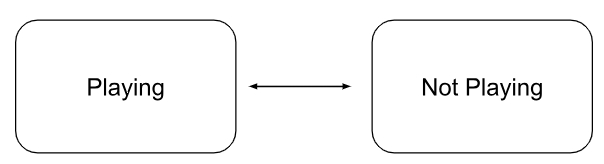
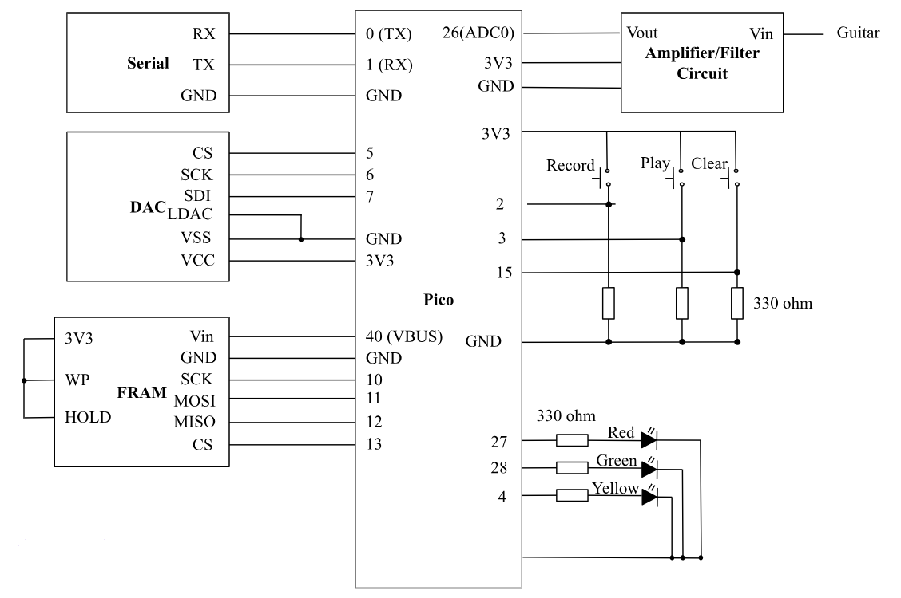
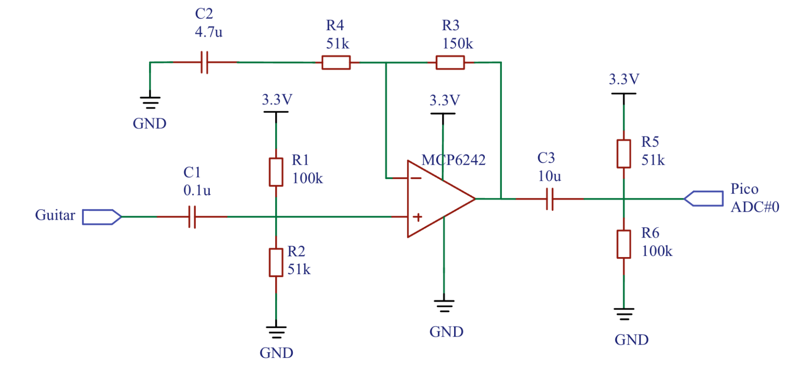

## **Project Introduction**

### One sentence "sound bite" that describes your project.
“Pi-Looper”, an innovative and affordable loop station empowers musicians to record and create their musical journey. 
### A summary of what you did and why.
* A loop station is a music device used by musicians for recording, looping, and playing back audio snippets in real-time during performance. It allows musicians to capture and reproduce short musical segments, often played on instruments or vocals, and then layer these recordings on top of each other to build complex arrangements. 
* We developed a loop station called “Pi-Looper” using Raspberry Pi Pico that empowers musicians to effortlessly layer, record, and save instrument tracks. Unlike traditional loop stations, “Pi-Looper” incorporates FRAM to enable users to save and retrieve tracks through serial communication, providing a new level of flexibility and persistence in music creations. We designed and tested an amplifier circuit to amplify instrument signal, in our case a guitar signal, to an optimal input range for the pico’s ADC. We then implemented loop station logic by designing a finite state machine (FSM) based on button inputs for record, playback, stop, and clear functionalities.

## **High level design**
### Rationale and sources of our project idea
* The inspiration of “Pi-Looper” emerged from a shared passion of music of all three members. We noticed that sometimes it’s very difficult for solo performers to create a full and dynamic sound without additional band members. With our experience in Lab1, where we synthesized bird songs using a DAC, we saw the potential to record, process, and playback audio using Raspberry Pi Pico. Therefore, we decided to build a loop station that allows solo performers to build up layers during a live performance and create intricate arrangements that appear as multiple musicians are playing simultaneously.

### Background math
#### Non-inverting Amplifier Circuit
A non-inverting amplifier circuit is an operational amplifier (op-amp) configuration where the input signal is connected to the non-inverting terminal (+) and the feedback is applied to the inverting terminal (-). The output is taken from the opamp’s output terminal. The key characteristic of a non-inverting amplifier is that it provides a voltage gain, which means the output voltage is amplified in relation to the input voltage. 

In an ideal op amp, we assume Vp = Vn and Ip=In =0 in a linear region. Since Vn=Vin, we can get  Vp=Vn=Vin. This simplifies the amplifier circuit to a voltage divider circuit:

Thus,  Vout=R1+R2R1*Vin=(1+R2R1)Vin. This equation can be rearranged to obtain the gain (A) of the circuit: A(1+R2R1). This background is essential for us to incorporate amplifier circuits for instrumental signal in our loop station design.

#### Low pass filter
Low pass filter is a circuit that allows low-frequency signals to pass through while blocking higher frequency signals. Instrumental signals, especially from a guitar or other electronic instruments, may contain high-frequency noises. A low pass filter helps to eliminate higher frequencies to form a cleaner audio signal. It can also prevent aliasing in digital processing. Aliasing happens when high-frequency components in the input signal exceed half of the digital samplin rate, in our case 8kHz, which could lead to distortion or unwanted sound effects. The diagram below shows a capacitive low-pass filter. The cutoff frequency of the circuit is calculated by f=1/(2πRC). 

#### High pass filter
A high-pass filter is a circuit that passes signals with high frequencies while attenuating lower-frequency signals. A high-pass filter is very efficient in filtering out low-frequency noises such as electrical hum, interference, or background rumble. The cutoff frequency of the high-pass filter in the diagram below can be calculated as: f=1/(2πRC). 

#### Nyquist–Shannon sampling theorem
The theorem suggests that a continuous signal can be completely represented in its samples and fully reconstructed from those samples if the sampling frequency is greater than twice the highest frequency of the signal. The recording aspect of the loop station is a sampling process of converting continuous-time signal into discrete-time signal by taking measurements of the signal at fixed time intervals. 
The ** Nyquist rate ** is defined as twice the maximum frequency present in the signal. For example, the highest effective frequency of a electrical guitar signal is 5 kHz, the Nyquist rate should by 10 kHz to ensure that the original signal can be accurately represented by its samples.
** Aliasing ** happens if a signal is sampled below its Nyquist rate. It is the phenomenon when different signals become indistinguishable during sampling processes. High frequency components of the signal can be reflected into lower frequency range, causing distortion of the sample.

#### Superposition of waves
In order to implement looper's basic function of adding different tracks of music together, we utilized principle of superposition by summing up the individual track value. To prevent from value overflow, we first attenuated the amplitude of each track by 50% and then summed them up. 

### logical structure
We don’t have specific FSM when we implement, instead, we used state variables to switch between different stages: first time recording, recording, playing, pause, clear.
#### Recording

For the state change between Recording and Not Recording, there are three methods:
1. Pressing the recording button when the recording is on, doesn’t care about if playing or not.
2. In recording mode, the recording time limit is up (10 seconds), it will automatically go to not recording and turn on playing. 
3. Press the playing button when in recording mode, when play is also on, will stop the playing and recording

#### Playing

For the state change between Recording and Not Recording, there are two methods:
Pressing the playing button when it’s not first time recording and not already playing will be able to play back the previous recordings. 
If pressing it when already playing, then it will pause.

#### First Recording 

For the state change between First Recording and Not Recording, there is one method: 
Pressing the recording button when it’s at first recording will change it to recording

### hardware/software trade-offs
Trade-off in our design includes 
* ADC noise
* High-frequency noise because we didn’t have low pass filter because we didn’t suspect that high-frequency noise is predominant when sampling.
* Memory restricting the length of each track
* Noise due to low sampling rate of 8k when guitar can produce 5k (Nyquist-Shar)
Discuss existing patents, copyrights, and trademarks which are relevant to your project.

## **Program/hardware design**
### hardware 
#### Schematics and wiring

#### Amplifier circuit

This circuit takes in the guitar input and passes it through a 0.1u decoupling capacitor. This capacitor will block any DC component of the signal and only allow AC signal to pass through, helping us to eliminate DC noise. Then R1 and R2 form a voltage divider to bias the op-amp and increase the signal’s value. These three components also form a high pass filter which has the following cut-off frequency:
fcutoff=12RC=12**33.33k*0.1u=47.772Hz
We know that common guitars usually produce effective sounds frequency from 75 to 5k Hz, so this cutoff frequency helps as eliminate low frequencies noise. 
The op-amp circuit has a gain of 1+R3R4=4 and amplifies the guitar input to have a greater pk-to-pk. The non-inverting input at pin 3 receives the guitar signal, while the inverting input at pin 2 is connected to the output at pin 1 through a feedback loop, which sets the gain of the amplifier. The feedback capacitor C2 helps roll off high-frequencies. The op-amp output is connected to another decoupling capacitor C1 to help us further ensure there’s no DC noise. Then passed through a set of R5 and R6 which is to bias the output to be a little smaller since we don’t want to break the GPIO.
To safely protect our GPIO from overvoltage, we added a Schottky diode in parallel with our Pico ADC. The diode will be turned on when the voltage is over 3.3V or lower than 0V, passing the overvoltage or reversed-voltage current directly to GND. When the voltage is smaller than 3.3 V but greater than 0, the diode is opened, so all the current can reach ADC.

#### Pico ADC
We used the on-board ADC at GPIO 26 which receives the output of the amplifier and it’s a 12-bit ADC with lower section 3 bits being noise so we right-shift 3 to eliminate those and left-shift before passing it to DAC.

#### External DAC (SPI)
We used the MCP4822 DAC with two independent DACs, each with a 12-bit resolution. The 12-bit input values for the DACs are written to the Pico via SPI interface (SDI, SCK, /CS) and clocked into the input register. Its output amplifier circuitry allows voltages down to 0V to operate with low output impedance for driving external loads. Output is then connected to the audio jack and connected to the speaker set. 

#### FRAM (SPI)
We learned abut FRAM and our memory restriction from Bruce. Pico’s RAM is around 260 KB with a 2MB flash program memory. This is enough for digital synthesized sounds, but not for audio recordings’ saving and replaying. Therefore, we look into using the nonvolatile FRAM that’s byte-addressable. Though it’s smaller than SD card, it’s enough for us to store small audio samples, enabling fast read/write of data. According to Bruce, we used MB85RS4MT which is a “half-megabyte memory which can read/write at 5 MB/sec over SPI using a 40 MHz SPI clock.” 
For writing and reading out of FRAM, we used fOpen(char* fileName) to create a file in FRAM, then fWrite(open_block_index, input_pointer, num_bytes) to write the data in the buffer to the file, and fClose(open_block_index) to close the file. For reading the file out of FRAM when the user want to play the saved audio, fRead(open_block_index, output_pointer, num_bytes) is used.

