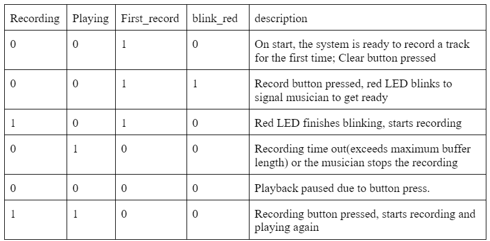

### Software program details

#### General
**Consideration in memory**: The current track is stored in a char buffer of size 80000. Since the sampling and output frequency are both 8k Hz, this buffer size corresponds to 10 seconds. That is, our looper is capable of recording and layering on top of a track of maximum length 10 seconds. This buffer is stored in Pico’s RAM, which has a capacity of 256 kB. Since the buffer is 800000 bytes in size, corresponding to 80kb, it occupies a rather significant amount of RAM, considering that there are a number of other variables we monitor for. We therefore introduce external memory FRAM to implement functionalities in saving recorded tracks. 

**Considerations in state transitions**: There are four state variables: recording, playing, and first_record, and blink red. These states are changed by both button presses and logic within the code. Since button presses are not the only source of change in state, and one button press does not necessarily corresponds to only one change, tthere are a bit more logic to consider when buttons are pressed. For example, we do not want to record when the track is not playing. Therefore, on transition of recording state from low to high, if playing is low, we would force it to high. Another example is when we press record for the frist time, the recording state should not become high immediately, since we need the red led to blink first. Therefore, recording would only be set to high after blink_red becomes low. 

**Valid combination of states** (in typical sequence)

#### Threads

##### LED
The `led_thread` is responsible for managing the LED indicators of the system. It toggles the LED based on the states. The red LED indicates whether or not the system is recording. The green LED indicates whether or not the system is playing. The yellow LED indicates whether or not the track is ready for first-time record and/or recording for the first time. 
The red LED also flashes three times right before the start of first-time record so that the musician can get ready, and a blink_red state is set accordingly. Whenever blink_red is high, playing is set to low, recording is set to low, and the red LED would turn on for half a second, off for half a second and repeat three times. The delay is implemented with sleep rather than YIELD since we do not want any button presses and releases to be detected during this period, which might interfere with the states and cause the program to enter an invalid combination of states. 

##### Serial
The `serial_thread` handles serial communication to save track to FRAM and play tracks saved in FRAM based on user input. User can first enter either ‘save’ or ‘play’, then select the track number they would like to save or play. 
On a save operation, a file is first opened, then the buffer is written into the opened file using `fWrite()`. Finally the file is closed. We use an array of int to track the length of the tracks saved to each file in FRAM so that when it gets played, the loop has the appropriate length. This list is updated when a track is saved.
On a play operation, the file is first opened, and data in the file is written into the buffer, and lastly the file is closed. The length is fetched from the array and stored into `track_length` variable. If a track selected for play has not been saved before, the data will not be loaded into the buffer, and there will be a prompt to let the user know. 

#### IRQ handler

##### Timer interrupt 
The timer interrupt is set up to be serviced at a frequency of 8k Hz, corresponding to the sampling rate and the rate at which data is sent to audio jack through DAC. 
If the system is playing, the data in appropriate position will be sent to DAC, in order to be played by the speaker. Note that the data is sent before being modified, in the case that the track is also in recording mode. This is due to the fact that we have one of the two channels of the speaker connected to the amplified guitar sound directly, and the other channel connected to DAC output. 
If the system is currently in recording, then data will be read from Pico’s onboard ADC, right-shifted by 3 bits (since the last 3 bits are all noise). If we are recording a track for the first time, the ADC data will be directly stored in the appropriate position in the buffer. Otherwise, the current data in buffer and ADC data will be halved then added, in order to prevent overflow. 
When the system is recording for the first time, there is a `track_length_counter` to keep track of the number of samples taken on the first record. If the counter exceeds length of the buffer, then the track_length is set to be length of buffer, and the first record would end. In later playing and recording, a `track_position` is incremented when the system is playing, and reset when it reaches `track_length`. 

##### GPIO interrupt 
We monitor for falling edge on the three buttons, and change the state based on input and the current state (much like a mealy machine). One interesting note is that the Pico SDK does not support having multiple service routine for GPIO interrupts (so one routine for each button is now allowed). Instead, we need to handle all gpio interrupt in one routine and service the interrupt based on the channel that triggers the interrupt. The most important thing we need to make sure is that we never enter an invalid combination of states, since the system would have unpredictable behavior in such cases. 
If play is pressed, the state of playing is simply flipped. And after the modification, if the system is not playing, `recording` will also be set to low. 
If clear is pressed, playing, recording, and blink_red are all set to low, and first_record is set to high. Everything in buffer is cleared, track_length counter and track_length is resetted. 
If recording is pressed, we first determine if this is the track’s first time recording and if the track is currently recording or not. If the track is not currently recording, then first recording is started. Otherwise, the first recording is ended and `track_length` would be updated to match `track_length_count`. If the track is not in its first recording, then recording is simply toggled, and playing would be turned on if recording is high after being toggled.  
Be sure to specifically reference any design or code you used from someone else.
Amplifier circuit https://www.tomshardware.com/news/raspberry-pi-pico-guitar-midi-converter 
Fram code https://people.ece.cornell.edu/land/courses/ece4760/RP2040/C_SDK_memory/index_memory.html 
Things you tried which did not work
Bandpassing signal from dac before feeding into speaker jack
We think this was because the values of R and C aren’t right and resulting in a wrong cut-off frequency. It failed because, after bandpassing the signal, we couldn’t hear anything outputting from the speaker.
Gpio_set_irq_enable_with_callback ignores the GPIO parameter, event on different gpio would enter the same handler LOL
Therefore we combined the GPIO callback functions into one and used conditional statement to determine which one is interrupting the program and to service which GPIO.
